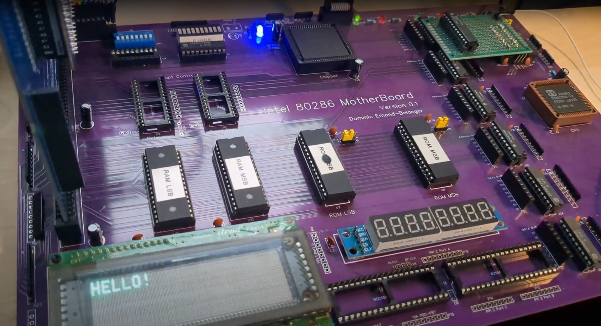

# Homebrew 80286 computer v0.1

This is the repo for my homebrew 80286 hobbyist computer. This is only to keep track of my work and is not meant to be a well documented project at this stage.

## Follow the project
You can follow the project developpement on my website :
https://dominicemond.wordpress.com/category/homebrew-computers/intel-80286/

The project is also on Hackaday.io :
https://hackaday.io/project/192468-intel-80286-homebrew-computer